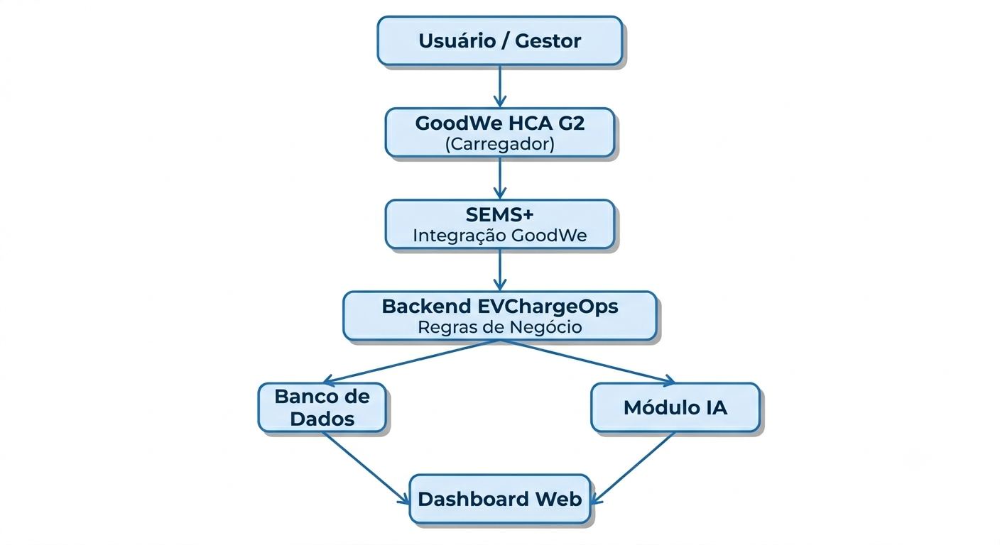
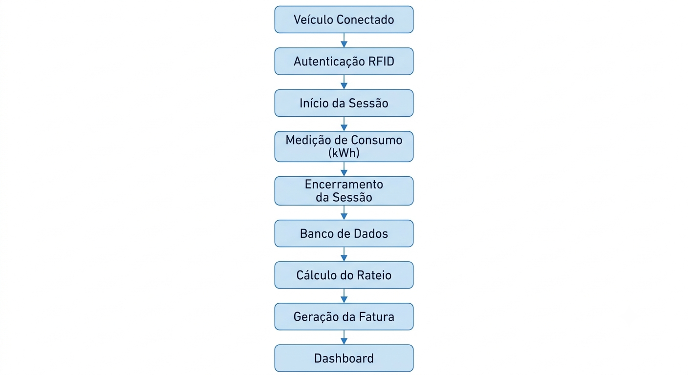
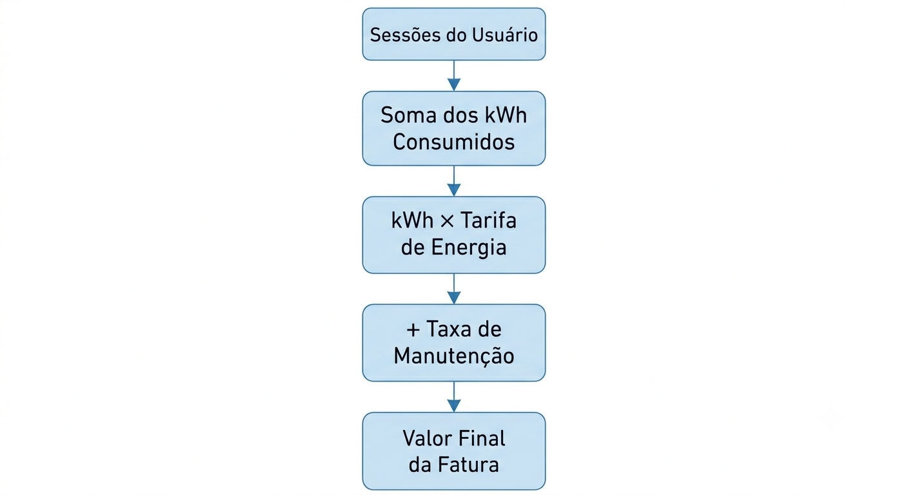
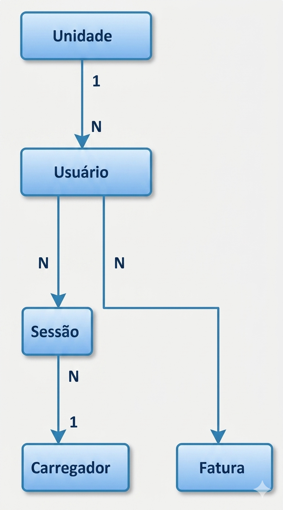

# Enterprise Challenge 2026 – EV ChargeOps

## Sprint 01 – Pesquisa e Documentação

## Grupo 20

**Integrante:** Luiz Lucas Guimarães
**RM:** RM574169

---

# 1. Introdução

A mobilidade elétrica vem apresentando crescimento acelerado no Brasil e no mundo. O aumento da frota de veículos elétricos tem impulsionado a expansão da infraestrutura de recarga, criando novas oportunidades e desafios para condomínios residenciais, edifícios corporativos, estacionamentos e instituições de ensino.

Nesse contexto, o compartilhamento de carregadores torna-se uma alternativa economicamente viável, pois reduz custos de instalação e permite melhor aproveitamento dos equipamentos. Entretanto, essa modalidade também gera dificuldades relacionadas à identificação dos usuários, ao controle do consumo energético e à distribuição justa dos custos de utilização.

O desafio proposto pela GoodWe consiste em transformar os dados gerados pelas sessões de recarga em informações capazes de apoiar a gestão da infraestrutura compartilhada. Para atender essa necessidade, o Grupo 20 propõe o desenvolvimento do **EV ChargeOps**, uma plataforma destinada ao gerenciamento de sessões de recarga, cálculo de consumo individual, geração de faturas e apoio à tomada de decisão por meio da análise dos dados coletados.

Este documento apresenta o resultado da Sprint 01 do Enterprise Challenge 2026, contemplando as pesquisas realizadas, as decisões arquiteturais adotadas e o planejamento para a Sprint 02.

---

# 2. Contexto do Problema

## Crescimento da Mobilidade Elétrica

O mercado de veículos eletrificados vem registrando crescimento expressivo nos últimos anos. Segundo dados da Associação Brasileira do Veículo Elétrico (ABVE), o Brasil alcançou recordes consecutivos de comercialização de veículos eletrificados, ampliando significativamente a frota em circulação.

Paralelamente, a infraestrutura de recarga também apresentou expansão relevante, com aumento do número de eletropostos públicos e semipúblicos distribuídos pelo território nacional.

Esse cenário demonstra que a mobilidade elétrica deixou de representar uma tendência futura e passou a constituir uma realidade crescente para consumidores, empresas e instituições.

---

## O Problema da Recarga Compartilhada

Embora a expansão da infraestrutura seja fundamental para o desenvolvimento do setor, a simples instalação de carregadores não resolve todos os desafios operacionais associados à utilização compartilhada dos equipamentos.

Em condomínios, empresas e universidades, um mesmo carregador pode ser utilizado por diversos usuários ao longo do dia, tornando necessária a existência de mecanismos capazes de identificar quem utilizou o equipamento, registrar o consumo individual e distribuir os custos de forma transparente.

Sem uma gestão adequada, surgem dificuldades relacionadas ao controle operacional, à cobrança dos usuários e ao planejamento da expansão da infraestrutura.

---

## Principais Desafios em Condomínios Residenciais

Nos condomínios, o principal desafio consiste em associar corretamente cada sessão de recarga ao respectivo morador.

Os problemas mais frequentes incluem:

* dificuldade em identificar quem realizou determinada recarga;
* ausência de histórico consolidado de utilização;
* dúvidas sobre o consumo individual;
* conflitos relacionados à divisão dos custos de energia;
* falta de transparência para síndicos e moradores.

Sem um sistema de controle adequado, torna-se difícil garantir uma cobrança justa e auditável.

---

## Principais Desafios em Empresas

Em ambientes corporativos, os carregadores podem ser utilizados por funcionários, visitantes e veículos da própria organização.

Entre os desafios observados destacam-se:

* controle dos usuários autorizados;
* monitoramento dos custos operacionais;
* geração de relatórios de utilização;
* acompanhamento da ocupação dos carregadores;
* identificação dos períodos de maior demanda.

Essas informações são importantes para o planejamento da infraestrutura e para a tomada de decisões relacionadas à expansão da capacidade de recarga.

---

## Principais Desafios em Universidades

Instituições de ensino apresentam um cenário ainda mais dinâmico devido ao elevado número de usuários potenciais.

Os principais desafios incluem:

* grande volume de usuários compartilhando os equipamentos;
* controle da utilização dos carregadores;
* monitoramento dos horários de pico;
* geração de indicadores de uso;
* organização da disponibilidade dos recursos.

Nesses ambientes, a gestão eficiente depende diretamente da disponibilidade de dados confiáveis e atualizados.

---

## Tendência Futura

O crescimento contínuo da frota de veículos elétricos indica que a demanda por infraestrutura compartilhada tende a aumentar nos próximos anos.

À medida que mais usuários passam a utilizar os mesmos equipamentos, cresce também a necessidade de ferramentas capazes de:

* registrar sessões automaticamente;
* identificar usuários;
* calcular consumos individuais;
* gerar cobranças transparentes;
* produzir relatórios gerenciais;
* apoiar decisões relacionadas à expansão da infraestrutura.

Dessa forma, a gestão da recarga passa a ser tão importante quanto a própria instalação dos carregadores.

---

## Análise do Grupo 20

O Grupo 20 observa que o crescimento da mobilidade elétrica traz desafios que vão além da infraestrutura física de recarga. Embora a instalação dos equipamentos seja fundamental, a gestão do uso compartilhado torna-se cada vez mais relevante à medida que aumenta o número de usuários.

A ausência de mecanismos de identificação, controle de consumo e transparência na cobrança pode gerar conflitos e dificultar a expansão da infraestrutura. Nesse contexto, o EV ChargeOps é proposto como uma plataforma capaz de transformar dados operacionais em informações úteis para gestores e usuários, permitindo controle das sessões, cálculo de rateio, geração de relatórios e apoio à tomada de decisão.

---

# 3. Frente 1 – Contexto e Problema

## 3.1 Infraestruturas de Recarga Compartilhada

Infraestruturas de recarga compartilhada são sistemas nos quais um ou mais carregadores de veículos elétricos são utilizados por múltiplos usuários.

Esse modelo é amplamente empregado em condomínios residenciais, edifícios corporativos, estacionamentos e campus universitários, permitindo a redução dos custos de instalação e melhor aproveitamento dos equipamentos disponíveis.

### Benefícios

* redução do investimento inicial;
* melhor utilização dos carregadores;
* menor necessidade de instalações individuais;
* possibilidade de expansão gradual da infraestrutura.

### Desafios Operacionais

* identificação correta dos usuários;
* controle das sessões de recarga;
* cálculo de consumo individual;
* distribuição dos custos;
* geração de relatórios gerenciais;
* gerenciamento dos horários de pico.

---

## 3.2 Funcionamento de uma Sessão de Recarga

Uma sessão de recarga corresponde ao período compreendido entre a conexão do veículo ao carregador e o encerramento do carregamento.

Fluxo simplificado:

1. Veículo conectado ao carregador;
2. Identificação do usuário;
3. Liberação da recarga;
4. Transferência de energia;
5. Monitoramento da sessão;
6. Encerramento;
7. Registro dos dados.

Durante esse processo, diversas informações são geradas e podem ser utilizadas pela plataforma.

### Dados Produzidos

* identificador da sessão;
* usuário responsável;
* data da utilização;
* horário de início;
* horário de término;
* duração da sessão;
* energia consumida (kWh);
* potência média;
* potência máxima;
* carregador utilizado;
* status final da sessão.

Esses dados constituem a principal fonte de informação utilizada pelo EV ChargeOps.

---

## 3.3 Modelos de Negócio para Recarga Compartilhada

### Recarga Gratuita

O usuário não realiza qualquer pagamento pela energia utilizada.

**Vantagens**

* simplicidade operacional;
* incentivo à adoção dos veículos elétricos.

**Desvantagens**

* custos integralmente assumidos pelo operador;
* risco de utilização excessiva.

---

### Cobrança por kWh

O usuário paga pela quantidade de energia efetivamente consumida.

**Vantagens**

* maior justiça na cobrança;
* relação direta entre consumo e valor pago.

**Desvantagens**

* necessidade de medição precisa do consumo.

---

### Cobrança por Tempo

O usuário paga pelo tempo de utilização do carregador.

**Vantagens**

* incentiva a liberação rápida da vaga.

**Desvantagens**

* nem sempre representa o consumo real de energia.

---

### Assinatura Mensal

O usuário paga um valor fixo periódico.

**Vantagens**

* previsibilidade financeira.

**Desvantagens**

* possibilidade de subsídio cruzado entre usuários.

---

### Rateio Condominial

Os custos são distribuídos entre os usuários de acordo com regras previamente estabelecidas.

**Vantagens**

* adequado para ambientes compartilhados.

**Desvantagens**

* exige transparência e controle detalhado.


## 3.4 Análise de Mercado

Com o objetivo de compreender como o mercado vem enfrentando os desafios relacionados à gestão da recarga compartilhada, foram analisadas três soluções consolidadas no setor: ChargePoint, Wallbox e Zaptec.

---

### ChargePoint

A ChargePoint é uma das maiores plataformas globais de recarga para veículos elétricos, oferecendo soluções para empresas, estacionamentos, condomínios e operadores de infraestrutura.

#### Problema que Resolve

Gerenciamento centralizado de estações de recarga e monitoramento de usuários.

#### Principais Funcionalidades

* monitoramento remoto dos carregadores;
* controle de acesso dos usuários;
* geração de relatórios;
* cobrança de sessões;
* aplicativo para motoristas;
* gerenciamento centralizado.

#### Modelo de Negócio

Venda de hardware e serviços de gestão em nuvem.

#### Limitações

* dependência de ecossistema proprietário;
* custos elevados para pequenas operações;
* menor flexibilidade para customizações específicas.

---

### Wallbox

A Wallbox oferece carregadores inteligentes destinados principalmente a residências e empresas.

#### Problema que Resolve

Simplificação do processo de recarga por meio de equipamentos conectados e gerenciamento remoto.

#### Principais Funcionalidades

* controle via aplicativo;
* monitoramento do consumo;
* agendamento de recargas;
* integração com sistemas energéticos;
* gerenciamento remoto.

#### Modelo de Negócio

Venda de carregadores inteligentes e serviços complementares.

#### Limitações

* foco maior no carregador do que na gestão compartilhada;
* recursos avançados dependem de integrações adicionais.

---

### Zaptec

A Zaptec possui forte atuação em ambientes compartilhados, especialmente condomínios residenciais.

#### Problema que Resolve

Distribuição eficiente da energia entre múltiplos usuários.

#### Principais Funcionalidades

* identificação individual dos usuários;
* monitoramento remoto;
* balanceamento dinâmico de carga;
* gerenciamento centralizado;
* controle de múltiplos carregadores.

#### Modelo de Negócio

Venda de equipamentos e plataforma de gerenciamento.

#### Limitações

* maior complexidade de implantação;
* custos iniciais mais elevados;
* dependência da infraestrutura própria da solução.

---

### Comparação das Soluções

| Critério               | ChargePoint | Wallbox  | Zaptec |
| ---------------------- | ----------- | -------- | ------ |
| Controle de usuários   | Sim         | Parcial  | Sim    |
| Monitoramento remoto   | Sim         | Sim      | Sim    |
| Aplicativo móvel       | Sim         | Sim      | Sim    |
| Cobrança de sessões    | Sim         | Limitada | Sim    |
| Gestão compartilhada   | Sim         | Parcial  | Forte  |
| Balanceamento de carga | Sim         | Sim      | Forte  |
| Foco em condomínios    | Médio       | Baixo    | Alto   |

---

## 3.5 Análise do Grupo 20

A análise das soluções estudadas demonstra que o mercado já possui ferramentas robustas para monitoramento de carregadores e gerenciamento energético.

Entretanto, observou-se uma oportunidade para ampliar a transparência relacionada ao consumo individual, à geração de faturas e à utilização dos dados para apoio à tomada de decisão.

O EV ChargeOps busca aproveitar os dados gerados pelos carregadores para oferecer funcionalidades voltadas ao controle das sessões, cálculo de rateio, geração de cobranças e produção de indicadores gerenciais, complementando capacidades já presentes nas soluções existentes.

---

# 4. Frente 2 – Base Regulatória e Técnica

## 4.1 Resolução Normativa ANEEL nº 1.000/2021

A Resolução Normativa nº 1.000/2021 consolidou as principais regras relacionadas à prestação do serviço público de distribuição de energia elétrica no Brasil.

Além de reunir direitos e deveres dos consumidores e distribuidoras, a regulamentação também estabelece diretrizes relacionadas à infraestrutura de recarga para veículos elétricos.

Para o contexto do EV ChargeOps, essa regulamentação é importante porque reforça a necessidade de controle adequado do consumo energético e de conformidade com os requisitos aplicáveis à operação das instalações elétricas.

### Impactos para o EV ChargeOps

* necessidade de transparência na cobrança;
* registro adequado do consumo energético;
* compatibilidade com os requisitos das distribuidoras;
* suporte à utilização em ambientes compartilhados;
* conformidade com normas aplicáveis à infraestrutura de recarga.

---

## 4.2 Carregador GoodWe HCA G2

O GoodWe HCA G2 é um carregador inteligente para veículos elétricos projetado para integração com sistemas fotovoltaicos, armazenamento de energia e monitoramento remoto.

Além da recarga convencional, o equipamento pode operar integrado ao ecossistema energético da GoodWe e ser monitorado pela plataforma SEMS+.

---

### Interfaces de Comunicação

#### RFID

Permite identificar usuários por meio de cartões de acesso.

Aplicações:

* autenticação de usuários;
* associação das sessões aos responsáveis;
* controle de acesso ao equipamento.

---

#### Wi-Fi

Permite comunicação do carregador com a internet.

Aplicações:

* envio de dados para a plataforma;
* monitoramento remoto;
* sincronização de informações.

---

#### LAN (Ethernet)

Permite comunicação por rede cabeada.

Aplicações:

* maior estabilidade de conexão;
* operação em ambientes corporativos;
* redução de falhas de comunicação.

---

#### Bluetooth

Permite configuração local do equipamento.

Aplicações:

* instalação inicial;
* manutenção;
* diagnóstico local.

---

#### RS-485

Interface amplamente utilizada em automação industrial.

Aplicações:

* integração com sistemas externos;
* comunicação com controladores;
* expansão futura da solução.

---

## Plataforma SEMS+

O carregador HCA G2 integra-se à plataforma SEMS+, utilizada pela GoodWe para monitoramento e gerenciamento de equipamentos energéticos.

Por meio dessa plataforma é possível:

* monitorar sessões de carregamento;
* acompanhar consumo energético;
* visualizar relatórios;
* programar horários de recarga;
* gerenciar equipamentos conectados.

---

### Dados Relevantes para o EV ChargeOps

Os dados disponibilizados pela infraestrutura GoodWe permitem alimentar os processos centrais da plataforma.

Entre as informações consideradas mais relevantes estão:

| Informação              | Aplicação                    |
| ----------------------- | ---------------------------- |
| Usuário autenticado     | Identificação do responsável |
| Horário de início       | Controle da sessão           |
| Horário de término      | Controle da sessão           |
| Energia consumida (kWh) | Rateio e faturamento         |
| Potência utilizada      | Monitoramento                |
| Status do carregador    | Operação                     |
| Histórico de sessões    | Relatórios                   |
| Eventos de erro         | Diagnóstico                  |

---

## 4.3 APIs Complementares

Além das informações fornecidas pela GoodWe, o EV ChargeOps poderá utilizar APIs externas para enriquecer os dados apresentados aos usuários e gestores.

As APIs analisadas foram a Open Charge Map API e a Google Places API.

---

### Open Charge Map API

A Open Charge Map é uma base global de estações de recarga para veículos elétricos.

#### Dados Selecionados

* localização da estação;
* tipo de conector;
* potência do carregador;
* operador responsável;
* tipo de acesso;
* status operacional.

#### Aplicação no EV ChargeOps

Esses dados poderão auxiliar na visualização da infraestrutura de recarga e na identificação de características técnicas dos equipamentos disponíveis.

---

### Google Places API

A Google Places API fornece informações sobre locais físicos e estabelecimentos.

#### Dados Selecionados

* localização;
* horário de funcionamento;
* avaliações;
* informações do estabelecimento;
* recursos relacionados à recarga elétrica (`evChargeOptions`).

#### Aplicação no EV ChargeOps

Esses dados poderão enriquecer a experiência dos usuários ao fornecer contexto adicional sobre os locais onde a recarga está disponível.

---

### Comparação das APIs

| Critério                    | Open Charge Map           | Google Places       |
| --------------------------- | ------------------------- | ------------------- |
| Foco em mobilidade elétrica | Alto                      | Médio               |
| Dados de carregadores       | Sim                       | Parcial             |
| Dados de localização        | Sim                       | Sim                 |
| Informações comerciais      | Limitadas                 | Amplas              |
| Melhor aplicação            | Infraestrutura de recarga | Contexto geográfico |

---

## 4.4 Análise do Grupo 20

O Grupo 20 conclui que a infraestrutura GoodWe fornece os recursos necessários para coleta dos dados operacionais das sessões de recarga.

Além disso, as APIs analisadas podem complementar a solução ao fornecer informações relacionadas à infraestrutura e ao contexto geográfico dos pontos de recarga.

A combinação dessas fontes permite que o EV ChargeOps utilize dados operacionais, técnicos e contextuais para oferecer uma experiência mais completa para gestores e usuários.


# 5. Frente 3 – Arquitetura e Inteligência

## 5.1 Arquitetura da Solução

O EV ChargeOps foi concebido como uma plataforma de gestão de recarga compartilhada capaz de registrar sessões, calcular consumos individuais, gerar faturamento e fornecer informações para usuários e gestores.

A arquitetura proposta foi organizada em cinco camadas principais.

### Camada Física

Responsável pela interação direta com os veículos elétricos.

Componentes:

* Carregador GoodWe HCA G2;
* Veículos elétricos dos usuários.

Funções:

* fornecimento de energia;
* identificação dos usuários;
* registro inicial das sessões.

---

### Camada de Conectividade

Responsável pela transmissão dos dados gerados durante a recarga.

Componentes:

* Wi-Fi;
* LAN (Ethernet);
* Plataforma SEMS+.

Funções:

* sincronização das informações;
* envio dos dados para a plataforma;
* comunicação entre equipamento e sistema.

---

### Camada de Aplicação

Representa o núcleo da solução.

Funções:

* autenticação dos usuários;
* gerenciamento das sessões;
* cálculo de consumo;
* cálculo do rateio;
* geração de relatórios;
* emissão de faturas.

---

### Camada de Dados

Responsável pelo armazenamento permanente das informações.

Dados armazenados:

* usuários;
* unidades;
* carregadores;
* sessões;
* faturas.

---

### Camada de Inteligência e Apresentação

Responsável pela análise dos dados e disponibilização das informações para os usuários.

Funções:

* previsão de demanda;
* detecção de anomalias;
* recomendações operacionais;
* dashboards para usuários e gestores.

---

### Diagrama de Arquitetura





---

## 5.2 Fluxo dos Dados

O fluxo de dados da plataforma foi definido para garantir rastreabilidade desde o início da sessão até a geração da cobrança.

### Fluxo Operacional

1. Veículo conectado ao carregador;
2. Autenticação do usuário;
3. Início da sessão de recarga;
4. Registro do consumo energético;
5. Encerramento da sessão;
6. Armazenamento dos dados;
7. Cálculo do rateio;
8. Geração da fatura;
9. Exibição das informações no dashboard.

### Transformação dos Dados

#### Dados Brutos

* horário de início;
* horário de término;
* energia consumida;
* potência utilizada.

#### Dados Processados

* consumo mensal;
* custo individual;
* histórico de utilização.

#### Dados Analíticos

* horários de pico;
* padrões de uso;
* recomendações operacionais.

### Diagrama de Fluxo





---

## 5.3 Modelo de Rateio

O Grupo 20 optou por um modelo de cobrança baseado no consumo real de energia.

### Variáveis Utilizadas

* consumo energético (kWh);
* tarifa de energia;
* taxa de manutenção da infraestrutura.

### Fórmula Proposta

```text
Valor da Fatura =
(kWh Consumido × Tarifa de Energia)
+ Taxa de Manutenção
```

### Exemplo de Cálculo

Consumo:

* 50 kWh

Tarifa:

* R$ 0,90/kWh

Taxa de manutenção:

* R$ 5,00

Resultado:

```text
(50 × 0,90) + 5,00 = R$ 50,00
```

### Tratamento de Casos Especiais

#### Sessão interrompida

Cobrança apenas do consumo efetivamente registrado.

#### Usuário sem utilização

Não haverá cobrança de consumo.

#### Mais de um veículo

As sessões serão consolidadas para o mesmo usuário.

#### Falha de comunicação

A sessão será encaminhada para análise administrativa.

### Justificativa

O modelo baseado em consumo real foi escolhido por apresentar maior transparência, simplicidade e facilidade de auditoria.

### Diagrama do Rateio





---

## 5.4 Esquema da Base de Dados

A base de dados foi projetada para garantir rastreabilidade entre usuários, sessões e cobranças.

### Entidades

#### Usuário

* id_usuario
* nome
* email
* tipo_usuario
* id_unidade

#### Unidade

* id_unidade
* bloco
* numero
* responsavel

#### Carregador

* id_carregador
* modelo
* localizacao
* status
* potencia_maxima_kw

#### Sessão de Recarga

* id_sessao
* id_usuario
* id_carregador
* data_inicio
* data_fim
* kwh_consumido
* status_sessao

#### Fatura

* id_fatura
* id_usuario
* mes_referencia
* total_kwh
* valor_energia
* taxa_manutencao
* valor_total
* status_pagamento

---

### Relacionamentos

* Unidade 1 → N Usuários
* Usuário 1 → N Sessões
* Carregador 1 → N Sessões
* Usuário 1 → N Faturas

---

### Exemplos de Registros Simulados

#### Usuários

| ID   | Nome        | Unidade |
| ---- | ----------- | ------- |
| U001 | João Silva  | UN101   |
| U002 | Maria Souza | UN204   |

#### Sessões

| ID   | Usuário | Consumo  |
| ---- | ------- | -------- |
| S001 | U001    | 18,5 kWh |
| S002 | U002    | 24,0 kWh |

#### Faturas

| ID   | Usuário | Valor    |
| ---- | ------- | -------- |
| F001 | U001    | R$ 30,47 |
| F002 | U002    | R$ 26,60 |

### Diagrama ER





---

## 5.5 Análise do Grupo 20

O Grupo 20 conclui que uma arquitetura organizada em camadas facilita a manutenção, escalabilidade e evolução da solução. O modelo de rateio baseado em consumo real garante transparência para os usuários, enquanto a estrutura de dados proposta oferece rastreabilidade completa entre sessões e cobranças.

---

# 6. Papel da Inteligência Artificial

A inteligência artificial foi definida como um componente estrutural da solução, atuando diretamente sobre os dados gerados pelas sessões de recarga.

## Previsão de Demanda

Objetivo:

Antecipar períodos de maior utilização da infraestrutura.

Dados utilizados:

* histórico de sessões;
* horários de utilização;
* consumo energético;
* frequência dos usuários.

Benefícios:

* planejamento de expansão;
* identificação de horários de pico.

---

## Detecção de Anomalias

Objetivo:

Identificar comportamentos fora do padrão.

Exemplos:

* consumo excessivo;
* sessões muito longas;
* interrupções frequentes;
* falhas operacionais.

Benefícios:

* identificação rápida de problemas;
* aumento da confiabilidade da operação.

---

## Recomendações Operacionais

Objetivo:

Transformar dados em ações práticas.

Exemplos:

* sugestão de expansão da infraestrutura;
* redistribuição de horários;
* manutenção preventiva;
* revisão de regras operacionais.

---

## Análise do Grupo 20

O Grupo 20 entende que a inteligência artificial deve atuar como uma ferramenta de apoio à decisão e não apenas como um recurso complementar. Sua função é transformar os dados gerados pelas sessões de recarga em conhecimento útil para gestores e usuários.

---

# 7. Plano da Sprint 02

## Objetivo

Desenvolver um protótipo funcional do EV ChargeOps com base nas definições realizadas durante a Sprint 01.

---

## Tecnologias

| Camada         | Tecnologia   |
| -------------- | ------------ |
| Frontend       | React        |
| Backend        | FastAPI      |
| Banco de Dados | PostgreSQL   |
| IA             | Scikit-Learn |
| Diagramas      | Draw.io      |
| Documentação   | Markdown     |

---

## Ordem de Desenvolvimento

### Etapa 1

Modelagem do banco de dados.

### Etapa 2

Desenvolvimento do backend.

### Etapa 3

Cadastro de usuários, unidades e carregadores.

### Etapa 4

Registro das sessões de recarga.

### Etapa 5

Implementação do modelo de rateio.

### Etapa 6

Desenvolvimento do dashboard.

### Etapa 7

Implementação dos módulos de IA.

### Etapa 8

Testes e validação.

---

## Resultado Esperado

Ao final da Sprint 02, espera-se obter um protótipo funcional capaz de registrar sessões, armazenar dados, calcular cobranças individuais e apresentar indicadores para usuários e gestores.

---

# 8. Conclusão

O crescimento da mobilidade elétrica tem ampliado a necessidade de soluções capazes de gerenciar infraestruturas de recarga compartilhadas de forma transparente e eficiente. Ao longo desta pesquisa, o Grupo 20 analisou o contexto do setor, estudou soluções já existentes no mercado, avaliou aspectos regulatórios e definiu uma proposta de arquitetura para o EV ChargeOps.

Os resultados obtidos demonstram que a gestão das sessões de recarga representa um desafio crescente para condomínios, empresas e instituições de ensino. Questões relacionadas à identificação de usuários, controle de consumo e distribuição dos custos exigem mecanismos confiáveis de monitoramento e faturamento.

Como resposta a esse cenário, foi proposta uma plataforma composta por módulos de registro de sessões, cálculo de rateio, armazenamento de dados, geração de faturas e inteligência artificial. A arquitetura definida busca garantir rastreabilidade dos dados, transparência na cobrança e suporte à tomada de decisão.

Além disso, a utilização de inteligência artificial foi planejada como um componente estrutural da solução, atuando na previsão de demanda, detecção de anomalias e geração de recomendações operacionais.

Por fim, a Sprint 01 permitiu consolidar o entendimento do problema, definir a arquitetura da solução e estabelecer as bases para o desenvolvimento da Sprint 02.

---

# 9. Referências

* Associação Brasileira do Veículo Elétrico (ABVE).
* Agência Nacional de Energia Elétrica (ANEEL).
* GOODWE. HCA G2 EV Charger Datasheet.
* GoodWe – Plataforma SEMS+.
* Open Charge Map. API Documentation.
* Google Maps Platform. Places API Documentation.
* ChargePoint.
* Wallbox.
* Zaptec.
* SENATRAN.
* Instituto Brasileiro de Geografia e Estatística (IBGE).
